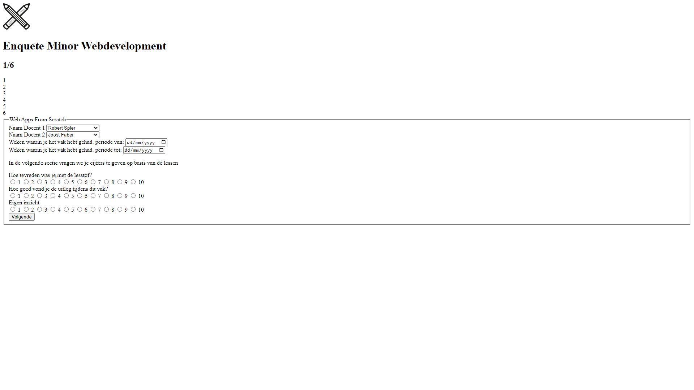
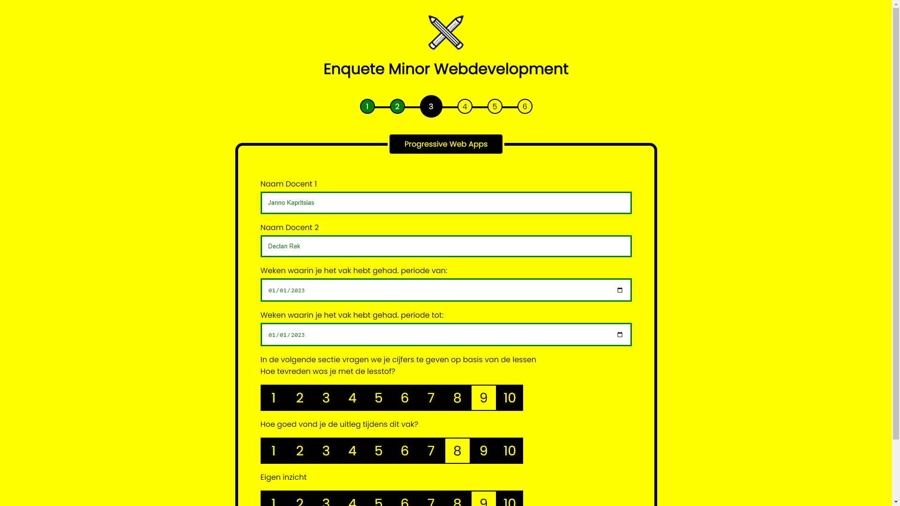

# WebDevelopment Minor Enquete

## Over de Minor Enquette

Voor het vak Browser Technologies heb ik een website gemaakt waar je enquette kan invullen over de Minor. Deze werkt in behoorlijk veek browers.

## User Story

Ik wil een enquête kunnen invullen over de minor Web Development, met verschillende antwoordmogelijkheden. Als ik de enquête niet afkrijg, wil ik later weer verder gaan met waar ik ben gebleven.

## Features

* Studentgegevens in vullen
* Docenten kunnen kiezen per vak
* Datum kunnen kiezen per vak
* beoordeling kunnen geven over lesstof, uitleg en inzicht per vak
* Positieve Validatie
* Terug kunnen gaan naar vorige pagina om antwoorden aan te passen (fake)
* Dark Mode
* Geen Javascript

## Geteste Browsers

* Google Chrome (telefoon + Desktop)
* Safari (telefoon + Desktop)
* Samsung Internet (telefoon)
* Microsoft Edge
* Opera (Desktop)
* Firefox (Desktop)
* Obscure Browser: UC Browser (telefoon + desktop)

## Live demo

Je kunt de applicatie testen op: https://martijnvdlans.github.io/BrowserTechnologies-2223/

## Testverslag

### Radiobuttons

Tijdens het testsen kwam ik er achter dat de radiobuttons op Safari, iPhone, niet reageerde op width: 0; height: 0;

Om dit te verbeteren heb ik meerdere opties geprobeerd. 

#### visibiliy: hidden; of display: none;

Met visibiliy: hidden; of display: none; werkte het meteen, maar kwam ik er toch wel snel achter dat dit een groot probleem met zich bee bracht, namlijk accessability. Met visibiliy: hidden; of display: none; kon je namelijk niet meer tabben door je website waardoor je geen cijfers kon geven. 

#### -webkit-appearance: none;

Met  -webkit-appearance: none; leek het heel even te werken, maar op bijna alle browsers kreeg ik nu zwarte boxen in plaats van niks.

#### opacity: 0;

Opacity 0 was uiteindelijk de beste optie om te gebruiken. Ondanks iphone nu een beetje een rare opzet heeft is het wel overzichtelijk en haalt het niet de mogelijkheid om te tabben door je website weg.

### Select + Date

Op safari, iPhone en Desktop, hadden select en date een beetje hun eigen leven. de style die je mee gaf aan de select en date gingen niet mee naar safari. Om dit op te lossen heb ik -webkit-appearance: none; gebruikt. Dit werkte gelukkig meteen.

### Dark Mode 

Darkmode wertke op heel veel browsers zoals naar behoren, wat heel fijn was. Echter waren er 2 browsers die een beetje raar deden.

#### Samsung Internet

op Samsung Internet werkt Dark Mode. Helaas is dit als default een eigen versie van dark mode die er een beetje raar uit ziet. Na wat onderzoek kwam ik er achter dat je de dark mode van pagina's aan kunt zetten.

Menu -> Instellingen -> Labs -> Donker thema website gebruiken

Op deze manier kun je de dark mode zien zoals de ontwikkelaars dit hebben bedoeld.

#### UC Browser [CHECK OF WERKT]

UC Browser bleek geen Dark Mode te ondersteunen dus ik heb even gezocht. Snel bleek dat UC hun eigen versie had van Dark Mode

##### Desktop

Op de desktop heb je rechts onder in de venster een maantje staan. Met deze kun je de helderheid van je browser aanpassen. Helaas word de helderheid alleen minder en kun je helaas geen eigen dark mode laten zien die je heb gecodeerd. 

##### Phone

Op de telefoon was dit hetzelfde. Je hebt de optie om bij menu -> Night aan te zetten. Dit is wederom hun eigen versie er van en niet aan te passen in je eigen code.

## Progressive Enhancement

### HTML

### HTML + CSS

### HTML + CSS + JAVASCRIPT

Voor dit project heb ik geen Javascript gebruikt.

## Author

Martijn van der Lans

## License

